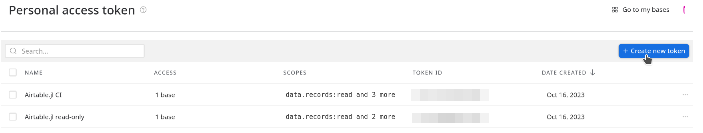
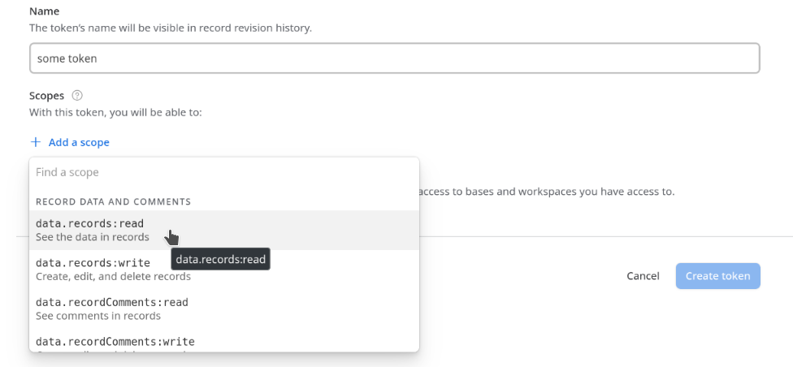
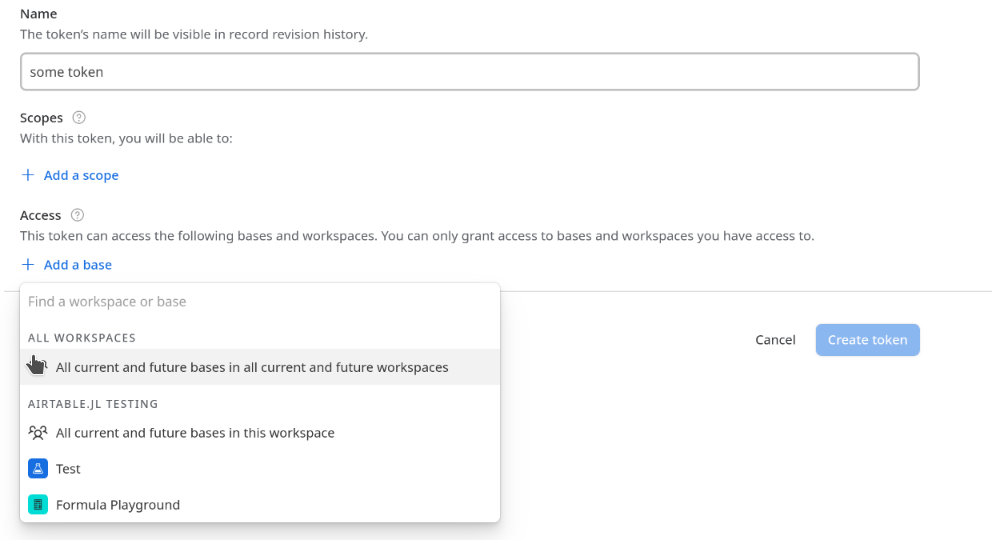

```@meta
CurrentModule = Airtable
```

# Airtable

An (unofficial) API for interacting with the [Airtable](http://www.airtable.com) API.

## Using this package

This package is wrapper for the Airtable REST API,
using [`HTTP.jl`](https://juliaweb.github.io/HTTP.jl/stable/) to do the hard stuff.

This documentation should be used in close conjunction with the Airtable API
documentation, which is generated automatically for you using your actual tables
(see below).

To use this documentation effectively,
you should understand a few of the terms Airtable uses:

1. A "Base" is like a project.
   There may be several tables contained within a base that can refer to each other.
2. A "Table" is a 2D array where each row is a "Record"
   and each column is "Field".
3. A "Record" (a row of a table) is an individual observation
   which may have any number of "field" values.
4. A "Field" (a column of a table) is a named and typed datapoint.
   When fields are missing for a given record, they are typically not included in API responses.

All API operations also require that you provide authorization in the form of a
personal access token (PAT).

### [Personal Access Tokens (PATs)](@id apikey)

!!! warning "Personal Access Token"
   Previous versions of this documentation used API keys,
   which are being phased out.
   You should now use Personal Access Tokens.
   [See here](https://support.airtable.com/docs/airtable-api-key-deprecation-notice) for more info.
   

To obtain your, go to the [create tokens](https://airtable.com/create/tokens) page,
then click "create new token".



Give your token a name,
then provide the required scopes (eg ability to read or write records)
and access (you can provide access to only a single base, or a whole workspace).





!!! note
   Once you click "done", you will not be able to retrieve your PAT.
   Be sure to put it in a secure place,
   or you will have to go through this process again.

To use any of this packages features, you will need to use an [`Airtable.Credential`](@ref).
This can be done explicitly by passing a PAT as a string to the `Credential()` constructor
(the PAT shown here has read-only access to the test table used by this package).

```julia-repl
julia> cred = Airtable.Credential("patfh3gwMkFASf6Ue.0103ff9d0148e6b573582e513a7f1dcb76300e52b67463c99d9c499f46f9fa98")
Airtable.Credential(<secrets>)

julia> Airtable.get(cred, #...)
```

Alternatively,
you can use `Preferences.jl` to set
`"readonly_pat"` or `"readwrite_pat"`,
or set the environmental variable `"AIRTABLE_KEY"`.

Eg.

```julia-repl
using Preferences

julia> set_preferences!(Airtable, "readwrite_pat"=>"<REDACTED>")

julia> julia> cred = Airtable.Credential()
Airtable.Credential(<secrets>)
```

!!! compat
   The use of `AIRTABLE_KEY` environment variable is maintained
   for backward compatibility, but
   using `Preferences` is recommended.   


The empty constructor is passed by default to all API functions,
and will use (in order)

1. "readwrite_pat" set in `Preferences`
2. "readonly_pat" set in `Preferences`
3. the environmental variable `AIRTABLE_KEY`

```@docs
Credential
```


### [Base ID](@id baseid)

Open your airtable base, click the help button in the upper right,
and then click "API documentation".
Airtable generates documentation for your sepecific base -
near the top you should see a sentence like the follwing,
with a different alphanumeric sequence for your base:

> The ID of this base is appphImnhJO8AXmmo

It will also appear in the url of the base documentation.
For example, the `Test` base for this repo has the url `https://airtable.com/appphImnhJO8AXmmo/api/docs`.


### Tablename

Within each base, you may have multiple tables.
The `tablename` argument in the following functions is just a string
with the table name, eg `"Table 1"`.
